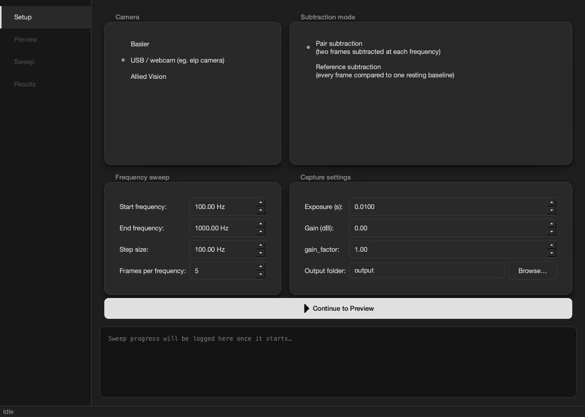
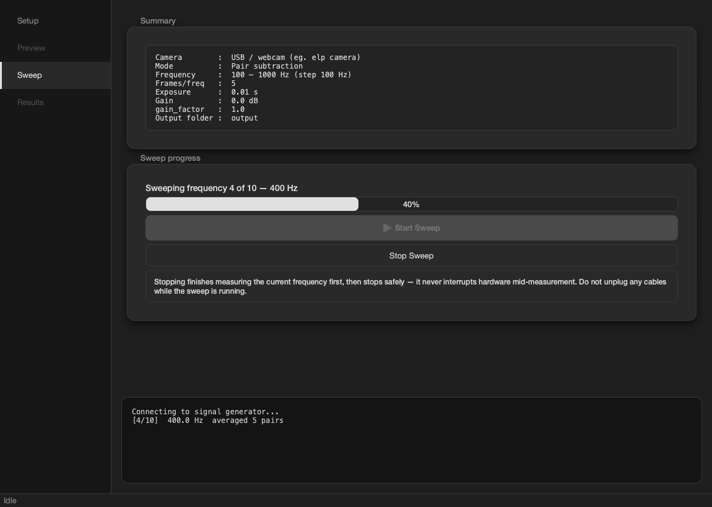
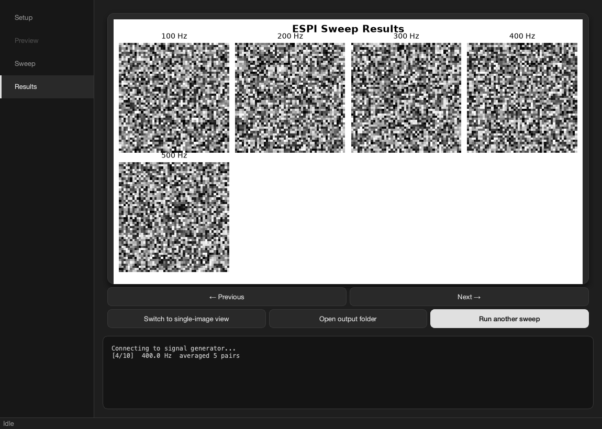
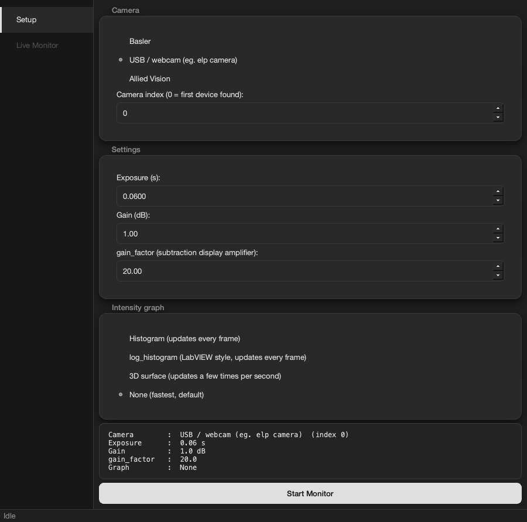
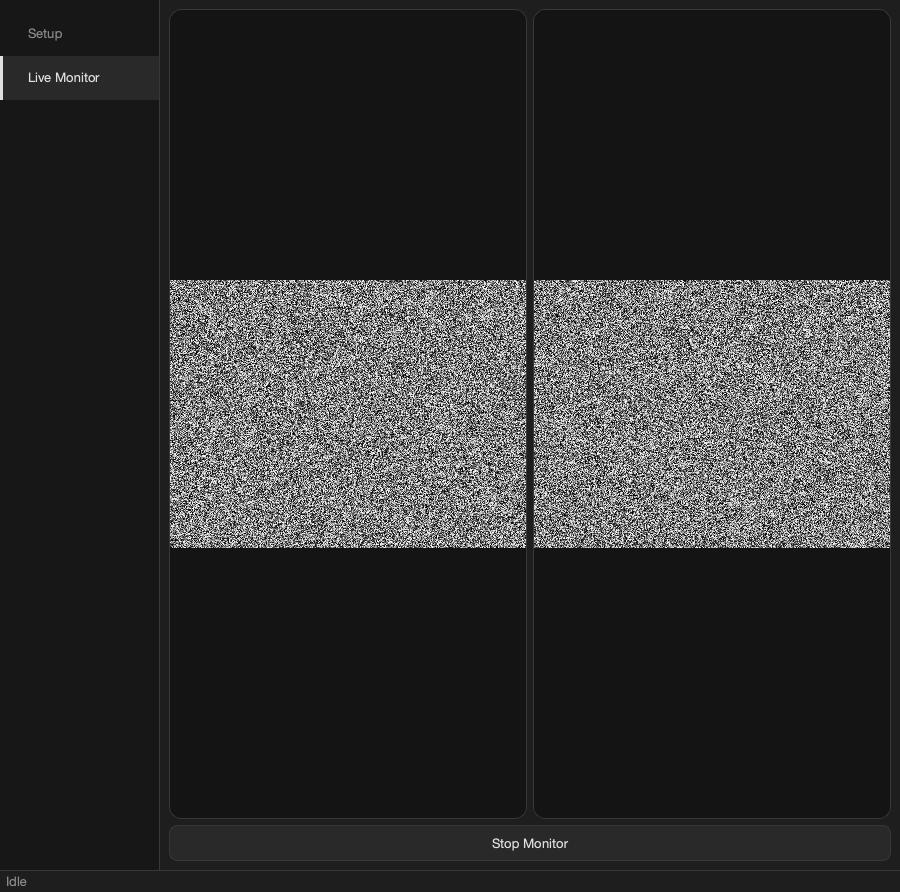

# ESPI Full Algorithm

This is the folder where all the working code for the ESPI (Electronic Speckle Pattern Interferometry) plate vibration experiment lives. Everything in here is either a library you can import into your own code, or a script you can run directly.

If you only want to run an experiment and are not interested in how the code works, you only need two files: `monitor.py` and `run_experiment.py`. The rest of this guide explains how to get those two files running on your computer, step by step, with no assumed programming experience.

## Before you start: what is "the terminal"?

Every step below asks you to type a command into "the terminal." If you have never used one before, here is what that means and how to open it.

A terminal (also called a command line, command prompt, or shell) is a window where you type text commands instead of clicking buttons. It looks intimidating the first time, but every command in this guide is written out exactly as you should type it, so you never have to guess or look up on the internet.

There are two different terminals you might use for this project, and either one works fine.

**Option 1: the terminal built into VS Code**

If you are viewing this file inside Visual Studio Code, you already have a terminal available inside it.

* Keyboard shortcut: press Ctrl + ` (the backtick key, usually just above Tab and to the left of the number 1 key) on Windows. On Mac, press Cmd + ` instead.
* Or use the menu: click **Terminal** at the top of the VS Code window, then **New Terminal**.

This opens a terminal panel at the bottom of the VS Code window, already pointed at the folder you have open in VS Code.

**Option 2: your computer's own terminal app**

**On Mac:** press Cmd + Space to open Spotlight Search, type `Terminal`, and press Enter. Or open Finder, go to Applications, then Utilities, and double click Terminal.

**On Windows:** press the Windows key, type `cmd` for Command Prompt (or `PowerShell`), and press Enter. Windows 11 usually opens something called "Windows Terminal," which can run either Command Prompt or PowerShell inside it. Either one works for this guide; anywhere a command only works in one of them, this guide says so explicitly.

Wherever you open a terminal, the commands below behave the same way once you are inside the right folder. Stage 3 explains how to get there.

## Getting started: Mac and Windows setup

Follow these stages in order. Each one has a check so you know it worked before moving to the next. Every stage that might be commonly confusiong also has an "if something goes wrong" note right underneath it; read that before asking for help if a check fails. Do not skip ahead. Every later stage assumes the earlier ones already worked.

### Stage 1: Make sure Python is installed

**Mac**

Open Terminal (see above) and type this, then press Enter:

```
python3 --version
```

You should see something like `Python 3.10.x` or newer.

If something goes wrong: seeing `command not found: python3` means Python is not installed yet. Download it from python.org, run the installer, then completely close and reopen Terminal (a terminal sometimes only notices newly installed programs after it restarts) and try the command again.

**Windows**

Open Command Prompt (search for `cmd` in the Start menu) and type this, then press Enter:

```
python --version
```

You should see `Python 3.10.x` or newer.

If something goes wrong: seeing `'python' is not recognized as an internal or external command` means Python is either not installed, or it was installed without being added to your system's PATH (the list of places Windows looks for programs by name). Download Python from python.org, run the installer, and this time check the box that says **"Add Python to PATH"** before clicking Install. Then completely close and reopen your terminal and try again. If it still fails after that, restart your whole computer; Windows sometimes needs a full restart to notice PATH changes.

### Stage 2: Get the code

You need Git installed to run the command below. If you would rather not install anything extra, you can instead download this project as a ZIP file from its GitHub page (look for a green "Code" button, then "Download ZIP"), unzip it, and skip straight to Stage 3, using wherever you unzipped it as your project folder.

If you are getting the code for the first time and do have Git, you can do command + shift + 'P' or ctrl + shift + 'P' on your mac, type: Git: Clone on the search menu that appears at the top of your screen, and click on the Git: Clone option that appears. Then paste this inside: https://github.com/Patrick948-stack/espi-plate-vibration.git. 

Another way to clone it is by typing this in your terminal:

```
git clone https://github.com/Patrick948-stack/espi-plate-vibration.git
```

If something goes wrong: seeing `'git' is not recognized` or `command not found: git` means Git is not installed. Download it from git-scm.com, run the installer using the default options, then completely close and reopen your terminal and try again. Or just use the ZIP download option mentioned above instead.

If you already have the code and want the latest change, type in your vs code terminal:

```
git pull
```

Check: you should see an `ESPI Full Algorithm` folder among many other files on your computer, either where `git clone` put it or where you unzipped the ZIP file.

### Stage 3: Open a terminal inside the right folder

Every command in this guide has to be run while your terminal is "inside" the `ESPI Full Algorithm` folder. If you run a command from the wrong folder, you will usually see an error like `No such file or directory` or `The system cannot find the file specified`. That almost always means you are in the wrong folder, not that something is actually broken.

**Mac**

```
cd "ESPI Full Algorithm"
```

`cd` means "change directory," which is the terminal's word for "folder." The quotes around the name are needed because the folder name has a space in it; without them the terminal would think you typed two separate folder names.

**Windows, option A (typed command)**

```
cd "ESPI Full Algorithm"
```

**Windows, option B (faster, no typing required)**

In File Explorer, open the `ESPI Full Algorithm` folder so you can see its contents. Click once on the empty part of the address bar at the top of the window, type `cmd`, and press Enter. A terminal window opens already inside that folder, with nothing left for you to type.

Check: type `ls` (Mac) or `dir` (Windows) and press Enter. You should see a list of files including `run_experiment.py` and `requirements.txt`. If those names show up, you are in the right place.

If something goes wrong: if `cd` says the folder does not exist, double check the spelling and capitalization, and make sure you started from the folder that actually contains `ESPI Full Algorithm` (for example, if you used `git clone`, start from wherever you ran that command).

### Stage 4: Create a virtual environment

A virtual environment is a private, self contained copy of Python just for this project. It keeps the packages this project needs separate from anything else installed on your computer, so nothing here can interfere with other Python projects, and nothing else can interfere with this one.

**Mac**

```
python3 -m venv venv_physics
```

**Windows**

```
python -m venv venv_physics
```

Check: a new folder called `venv_physics` should appear inside `ESPI Full Algorithm`. Confirm with `ls` (Mac) or `dir` (Windows) again.

If something goes wrong: this step rarely fails if Stage 1's check passed. If you see an error mentioning `ensurepip` or `venv`, reinstall Python from python.org using the full installer rather than a minimal one.

### Stage 5: Activate the virtual environment

"Activating" tells your terminal to use this project's private Python instead of your computer's main one. You have to do this every time you open a new terminal window to work on this project; it does not stay switched on permanently.

**Mac**

```
source venv_physics/bin/activate
```

**Windows, in Command Prompt**

```
venv_physics\Scripts\activate
```

**Windows, in PowerShell**

PowerShell blocks running scripts by default, for security reasons, so activation needs one extra line first:

```
Set-ExecutionPolicy -Scope Process -ExecutionPolicy Bypass
.\venv_physics\Scripts\Activate.ps1
```

If something goes wrong: a red error mentioning that "running scripts is disabled on this system" is that same PowerShell security block. Run the `Set-ExecutionPolicy` line above first; it only affects the current terminal window, not your whole computer, so it is safe to use. Then try activating again. If you would rather avoid PowerShell's script restrictions entirely, switch to Command Prompt instead, or use the fallback below.

**Fallback that works everywhere, if activation will not cooperate**

You can skip activation entirely and call this project's Python directly, by its full file path, instead:

```
.\venv_physics\Scripts\python.exe -m pip install -r requirements.txt
.\venv_physics\Scripts\python.exe monitor.py
```

Run these commands one line at a time, waiting for each to finish, so it is easy to tell exactly which one fails if there is a problem.

Check: after activating, the very start of your terminal's input line should now show `(venv_physics)` before anything else you type. If you do not see that, activation did not work and the next steps will use the wrong Python; go back and try again, or use the fallback above.

### Stage 6: Install the Python packages

With the environment active (you should see `(venv_physics)` at the start of your terminal line), run:

```
pip install -r requirements.txt
```

This reads the `requirements.txt` file in this folder and installs everything the project needs: numpy, opencv, pyvisa, matplotlib, pytest, and a few others. This step needs an internet connection and can take a few minutes the first time; that is normal, let it finish.

Check: run this to confirm everything loaded correctly:

```
python -c "import numpy; import cv2; import pyvisa; import matplotlib; print('All packages installed correctly')"
```

If you see `All packages installed correctly`, this stage is done.

If something goes wrong: seeing `'pip' is not recognized` or `command not found: pip` almost always means your virtual environment is not active; go back to Stage 5. A network or SSL related error usually means an internet or firewall problem; check your connection, and if you are on a school or work network, try a different one if you have access to one, since some of those networks block package installs. If the check command above names one specific package that failed to import, re-run `pip install -r requirements.txt` and scroll up through its output to find that package's actual error message; it usually explains exactly what went wrong.

### Stage 7: Run the automated tests

This is the most important check in the whole setup. There are hundreds of automated tests that verify every function in the project works correctly, and they all run without needing any camera or signal generator plugged in.

```
python -m pytest tests/ -v
```

A long list of lines will scroll by; that is normal, it is one line per test. Check the very last line of the output; it should say something like `435 passed`.

If something goes wrong: if the last line mentions any failures, scroll up; pytest prints exactly which function failed and why, right above that summary line. If every single test fails immediately with an import error, your virtual environment is probably not active, or Stage 6 did not finish successfully; go back and check both of those first.

If all the tests pass, the code itself is working correctly on your computer, and you are ready to set up whichever camera and signal generator you actually have.

### Stage 8: Camera specific setup (only if you have one of these cameras)

A plain USB webcam or an ELP camera works immediately with no extra steps; it uses opencv, which Stage 6 already installed. `capture_and_display_cv2.py` automatically picks the right camera driver for your operating system (DirectShow on Windows, AVFoundation on Mac), so the same code works unmodified on either.

**Basler camera**

1. Google **"Basler pylon Camera Software Suite download"**, or go directly to basler.com, then Support, then Downloads, then pylon Camera Software Suite, and pick the installer for your operating system.
2. The download page offers more than one file: a small **pylon Runtime** and a much larger, full **pylon Camera Software Suite** installer. **Download the bigger one.** The slim Runtime is missing pieces this project needs (no pylon Viewer, an incomplete SDK). The full Software Suite installer includes **pylon Viewer**, a standalone app for viewing the camera feed and testing settings outside Python, which is very useful for confirming the camera itself works before you touch any code, plus everything `pypylon` (the Python package) needs.
3. Run the installer and keep the default, full component selection. It installs camera drivers, not just software, so this step cannot be skipped even if you only care about the Python side.
4. Then, with `venv_physics` active, run:

```
pip install pypylon
```

Check:

```
python -c "from pypylon import pylon; print('Basler ready')"
```

If you see `Basler ready`, the Basler setup is complete.

**Allied Vision camera**

1. Google **"Allied Vision Vimba X download"**, or go directly to alliedvision.com, then Products, then Software, then Vimba X, and download the installer for your operating system. Vimba X is the current SDK; do **not** download the older "Vimba" (without the X) SDK, it is not compatible with this project's code.
2. Run the installer with the default options. This installs the camera drivers plus the Python API as a `.whl` file. That file is not published on the normal Python package index, so a plain `pip install vmbpy` will not work by itself; you have to point pip at the file directly, in the next step.
3. Find the wheel file inside the install folder. It is typically under:
   * Windows: `C:\Program Files\Allied Vision\Vimba X\api\python\`
   * Mac or Linux: wherever Vimba X was installed, under `api/python/`

   The file is named something like `vmbpy-<version>-py3-none-any.whl`.
4. Then, with `venv_physics` active, run:

**Mac**

```
pip install /path/to/vmbpy_file.whl
```

**Windows**: an easy way to get the right file path, instead of typing it manually, is to right click on the file once you find it, and click on "copy as path", then replace what comes after install in the bash command below with the copied text by doing ctr + v right after typing pip install. 

```
pip install C:\path\to\vmbpy_file.whl
```

Check:

```
python -c "import vmbpy; print('Allied Vision ready')"
```

If you see `Allied Vision ready`, the Allied Vision setup is complete.

### Stage 8.5: Signal generator setup (Windows only)

Mac and Linux can skip this entire stage; the signal generator works immediately once `pyvisa` and `pyvisa-py` are installed, which Stage 6 already did.

Windows needs one extra, one time step. This project talks to the signal generator through `pyvisa-py`, a lightweight backend that needs direct access to the USB device. Windows blocks that kind of direct access by default until a compatible driver is bound to the instrument. Mac and Linux allow it out of the box, which is why this step only applies to Windows.

`requirements.txt` already installs the native USB library `pyusb` needs (`libusb-package`) automatically on Windows; Stage 6's `pip install -r requirements.txt` handled that already, nothing extra to run for it. The one step that cannot be done through pip is binding a working driver to the instrument itself, since that is an operating system level USB permission, not a Python package. Pick one of the two options below for that.

**Option A: Zadig (recommended, free, a few MB, no restart needed)**

What Zadig actually does: `pyvisa-py` talks to USB instruments through `pyusb` and `libusb`, which need low level USB access that Windows does not grant by default. Zadig binds a generic driver called WinUSB to the instrument, so `libusb` (and therefore `pyvisa-py`) can see and talk to it. Zadig itself is not a Python package and has nothing to do with `pip`. It changes which driver Windows itself has bound to the USB device, which is why it has to be done by hand, once, outside of any `pip install`.

1. Google **"Zadig download"**, or go directly to [zadig.akeo.ie](https://zadig.akeo.ie). It is a single small executable file; there is nothing to install and no account needed.
2. Plug in the signal generator and power it on before opening Zadig, so it actually shows up in the device list.
3. Run the downloaded `zadig-*.exe` file. Windows may show a blue SmartScreen warning because it is a small, unsigned utility; click **More info**, then **Run anyway**. Zadig is a long established, widely used open source tool, so this warning is expected and not a sign anything is wrong.
4. In Zadig, click **Options**, then **List All Devices**. This step matters: by default Zadig hides devices it thinks are already using a normal driver, and instruments often fall into that category even though they actually need WinUSB instead.
5. Open the dropdown list at the top of the window and find the signal generator. It may show up under its model name, as **USB Test and Measurement Device**, or as **Unknown Device**. If more than one entry looks related to it (some instruments expose a separate control interface alongside the main one), you may need to repeat steps 5 and 6 for each one; only one of them is the actual interface this project needs.
6. Make sure the box on the right, next to the green arrow, says **WinUSB**. If it shows something else, use the up and down arrows next to that box to change it to WinUSB specifically; do not leave it on whatever it defaulted to.
7. Click **Replace Driver** (it may say **Install Driver** the first time you run it). Wait for the progress bar to finish, then close Zadig. No restart is needed.

This is a one time step per computer, but it is tied to the specific USB port you used. If you later plug the signal generator into a different USB port on the same computer, Windows may treat it as a new device, and you may need to repeat this once for that port.

Check, one layer at a time, with `venv_physics` active:

```
python -c "import usb.core; print(list(usb.core.find(find_all=True)))"
```

This talks to the USB driver layer directly, without `pyvisa` involved yet. An empty list `[]` or an error mentioning `NoBackendError` here means either `libusb-package` did not install correctly (re-run `pip install -r requirements.txt` and read closely for any error messages) or the Zadig driver step above still needs fixing; go back and recheck both before moving on.

Once that command prints the device, confirm `pyvisa` sees it too:

```
python -c "import pyvisa; rm = pyvisa.ResourceManager('@py'); print(rm.list_resources())"
```

The signal generator's address (something like `USB0::...::INSTR`) should appear in the printed list. You can also run `python test_signal_generator_only.py` for a full, step by step connection test with clearer explanations at each stage if something is still not working.

If the device is found but the instrument replies slowly or times out, run:

```
python debug_signal_generator_response.py --backend '@py' --timeout 20000
```

This prints which VISA backend was used, how long it took to find the device, and how long each common command took to get a reply.

**Option B: NI-VISA (heavier, official vendor runtime)**

Download and install the free NI-VISA runtime from National Instruments (ni.com). It installs its own driver and its own VISA backend.

Note: on Windows, this project's `get_resource_manager()` (used everywhere, through `discover_instruments()` and `open_connection()`) tries the OS's native VISA backend first, which only works if NI-VISA (or another VISA runtime) is installed, and falls back to `@py` if that fails to start. On at least one earlier development machine, NI-VISA didn't fail to start; it started fine but reported the signal generator under the wrong resource address (a serial/ASRL address instead of its real USB address), which made every command time out silently instead of raising an error. That specific failure is now handled too: `discover_instruments()` checks whether anything in the list of found resources actually looks like a USB instrument (its address starts with `USB`); if the native backend didn't report one, it doesn't trust that result and rescans with `@py` instead. You should not need to force `@py` by hand anymore. If you still see slow or timed-out commands after installing NI-VISA, please open an issue: that would mean this check needs revisiting. Mac and Linux are unaffected either way: they always use `@py`.

Zadig remains the simpler default choice for this project if you don't already need NI-VISA for another instrument: it is a tiny download with no installer, and it keeps the signal generator working through the same free `pyvisa-py` backend already used on Mac and Linux.

## Troubleshooting: diagnostic scripts

If a camera or the signal generator will not connect, this project includes five small standalone scripts whose only job is to help you figure out why. None of them run an actual experiment or move the plate; they are safe to run any time something is not working.

Run them from a terminal inside `ESPI Full Algorithm`, with `venv_physics` active. See "Before you start: what is the terminal?" near the top of this file if you are not sure how to open one. It does not matter whether you use the VS Code terminal or your computer's own terminal app; these scripts behave exactly the same either way.

**Which one should I run?**

| Symptom | Run this |
|---|---|
| A Basler camera will not connect at all | `basler_debug.py` |
| You are not sure if the signal generator shows up to your computer at all | `check_signal_generator.py` |
| You want a full, real test that the signal generator connects and actually accepts commands | `test_signal_generator_only.py` |
| The signal generator connects, but commands are slow or seem to hang | `debug_signal_generator_response.py` |
| One specific command keeps failing and you want to know if it is that command specifically, or something else that ran before it | `test_syst_err_isolated.py` |

If you are not sure where to start with the signal generator, run them in this order: `check_signal_generator.py` first (does your computer see it at all), then `test_signal_generator_only.py` (does it actually work end to end), then `debug_signal_generator_response.py` only if something is slow rather than simply broken.

**basler_debug.py**

Run:

```
python basler_debug.py
```

What it checks, one step at a time: whether the Basler pylon software is installed, whether Python is running directly on Windows rather than inside WSL, whether Windows Device Manager notices the camera, whether the pylon software itself can list any cameras, and finally whether it can actually open a connection to one.

How to read the output: it prints five numbered steps, `[1/5]` through `[5/5]`. Each step prints either that it succeeded, or an explanation of what is likely wrong plus a "What to do" line telling you the next thing to try. The first step that fails is your answer; you do not need to worry about the later steps, since they usually cannot even run until the earlier one is fixed.

**check_signal_generator.py**

Run:

```
python check_signal_generator.py
```

What it checks: this is the fastest, simplest check, and a good first step. It looks for the signal generator two different ways: first through the raw `pyusb` library (Step 1), then through `pyvisa` (Step 2), and prints what each one sees.

How to read the output: if Step 1 finds nothing, the problem is with your USB cable, driver, or the instrument's power, before Python is even involved. If Step 1 finds devices but Step 2 finds nothing, the instrument is plugged in but `pyvisa` does not recognize it yet as something it can talk to; on Windows that usually means the Zadig driver step above still needs to be done. If both steps find the device, you are ready to try `test_signal_generator_only.py` next.

**test_signal_generator_only.py**

Run:

```
python test_signal_generator_only.py
```

What it does: this is the most complete and realistic test. It connects to the signal generator, asks it to identify itself, sets a quiet 1 kHz test signal, turns the output on for 3 seconds, then turns it off and disconnects. It is safe to run any time; it never touches the camera or the plate.

How to read the output: it prints five numbered steps, `[1/5]` through `[5/5]`. A `Success` message at the very end means the signal generator is fully working and ready to use with `run_experiment.py`. If Step 1 says no instruments were found, work through the numbered checklist it prints, in order, starting from the top.

**debug_signal_generator_response.py**

Run:

```
python debug_signal_generator_response.py
```

Use this one specifically when the signal generator connects and responds, but slowly, or when you want to confirm that a setting you sent actually took effect. It is not meant to be your first troubleshooting step; run `check_signal_generator.py` and `test_signal_generator_only.py` first.

What it does: it asks the instrument several safe, read only questions and times how long each one takes to reply. Unless you add `--skip-write-tests`, it also changes the waveform, frequency, and amplitude on one channel, checks that each change actually took effect by reading it back, then restores the original settings when it is done.

How to read the output: at the end it prints a `Summary`. If it says every command completed quickly, nothing is wrong with response time. If it lists specific commands as slow, or as never getting a reply, those exact commands are the ones worth asking about; usually only one or two commands behave this way, which points to something specific to those commands rather than a broken connection.

Useful options:

```
python debug_signal_generator_response.py --trials 5
python debug_signal_generator_response.py --skip-write-tests
python debug_signal_generator_response.py --channel C2
```

`--trials 5` repeats each read-only question 5 times, which is useful for telling whether slowness happens every time or only occasionally. `--skip-write-tests` only asks questions; it will never change any setting on the instrument. `--channel C2` runs the write tests on channel 2 instead of channel 1.

**test_syst_err_isolated.py**

Run:

```
python test_syst_err_isolated.py
```

Use this only if `debug_signal_generator_response.py` reported that one specific command, `SYST:ERR?`, never got a reply. This script sends that exact command completely by itself, with nothing sent before it, to answer one narrow question: does this command fail even when nothing else could have confused the instrument first?

How to read the output: `Success` means the command worked when sent alone, which points to something about an earlier command interfering with it. `No reply` (a timeout) means the command simply does not work on this instrument, no matter what came before it. That second case is exactly what this project's own signal generator does: it is a known limitation of that one specific command on this instrument, not a bug in your setup, and it does not affect anything `run_experiment.py` actually needs.

### Stage 9: Run the experiment

With `venv_physics` active and all the checks above passing, run:

```
python run_experiment.py
```

The program will ask you which camera you are using, which subtraction mode you want, and what settings to use. It then opens a live preview so you can aim the camera, runs the frequency sweep, and shows you the results one image at a time when it is finished.

### Graphical version (`run_experiment_gui.py`)

Prefer clicking over typing in a terminal? `run_experiment_gui.py` is a PyQt6 dashboard covering the exact same four stages as `run_experiment.py` (Setup, Preview, Sweep, Results) as one window with a left-hand navigation rail, instead of typed terminal questions and separate popup windows.

```
python run_experiment_gui.py
```

<p align="center">
  
  
</p>
<p align="center">
  
</p>

**Setup**: camera, subtraction mode, and every sweep parameter (frequency range, frames per frequency, exposure, gain, gain_factor, signal generator amplitude and DC offset, output folder) on one page, arranged as five cards. Amplitude and offset reach the signal generator through the same `configure_channel()` call used everywhere else in this project: the hardware clamps them to safe ranges (2 mVpp - 20 Vpp for amplitude, +/-10V minus half the amplitude swing for offset) regardless of what is typed here. Click "Continue to Preview" when ready.

**Preview**: the live camera feed embedded directly in the window, using the exact exposure and gain you just set. Click "Lock in settings & continue" once the plate is in frame and focused.

**Sweep**: a summary of everything about to run, a real progress bar ("Frequency i of N"), and a live log console showing the sweep's own output as it happens. Click "Start Sweep" to begin, and "Stop Sweep" to end it early. A confirmation dialog explains what happens: the sweep finishes measuring whatever frequency it is currently on, then stops safely, so it never interrupts the camera or signal generator mid-measurement. Whatever frequencies were already measured are still saved and shown on the Results page. Closing the window during a running sweep asks the same question.

**Results**: the same results grid `run_experiment.py`'s terminal viewer saves to disk, embedded in the window, plus a single-image view with Previous/Next buttons and arrow-key navigation. "Open output folder" jumps straight to your saved images, and "Run another sweep" returns to Setup with your previous settings still filled in.

It requires PyQt6 and matplotlib (`pip install -r requirements.txt` already covers both). Every rule about what counts as a valid exposure, camera choice, or sweep parameter, and the entire sweep itself, comes straight from `run_experiment.py` and `complete_pipeline*.py`, so the two entry points can never give you a different result for the same settings.

## Running an experiment (quick reference for returning users)

Once everything above is set up, the only commands you need each time you come back are:

**Mac**

```
source venv_physics/bin/activate
python run_experiment.py
```

**Windows**

```
venv_physics\Scripts\activate
python run_experiment.py
```

The program walks you through the rest with on screen questions.

After the sweep finishes, a viewer opens showing your results one frequency at a time. Use the left and right arrow keys to move between images, and press Escape to close it. A grid image containing all frequencies is also saved to your output folder automatically, so you still have a copy even if you close the viewer early.

Exposure is always entered in seconds. For example, `0.01` means 10 milliseconds. The program converts that to whichever internal unit each camera actually needs automatically, so you never need to do that conversion yourself.

## Monitoring a camera before an experiment

If you just want to check focus, alignment, or brightness without running a full frequency sweep, use `monitor.py` instead of `run_experiment.py`:

```
python monitor.py
```

It asks which camera you want to monitor (Basler, USB or webcam, or Allied Vision), the camera index if that camera type supports more than one connected device, the exposure time in seconds, the gain in dB, a `gain_factor`, and whether you want an optional live graph. `gain_factor` only brightens what you see on screen in the "Frame Subtraction" window; it does not change the camera's actual raw data or its exposure or gain hardware settings.

Once you confirm your choices, it opens the matching `capture_and_display*.py` script with two windows, plus a third one if you asked for a graph:

* Live Feed: the raw frame straight from the camera, unmodified.
* Frame Subtraction: the absolute difference between each pair of consecutive frames, amplified by `gain_factor` so small changes are easier to see.
* histogram, log_histogram, or 3d (optional): a live graph of the raw frame's pixel intensity; see [Live pixel intensity graph](#live-pixel-intensity-graph) below for details.

Press `q` inside any of the camera windows to close the monitor and return to the terminal. Basler only ever connects to the first camera pypylon finds (`camera_control.py` has no index parameter), so `monitor.py` skips the camera index question for that choice.

If you are comfortable writing a little Python yourself, you can also call each `capture_and_display*.py` script's `main()` function directly from your own code instead of going through `monitor.py`'s interactive questions:

```python
import capture_and_display as cad
cad.main(exposure_us=10000, gain_db=1.0, gain_factor=20, graph_type="histogram")
```

### Graphical version (`monitor_gui.py`)

Prefer clicking over typing in a terminal? `monitor_gui.py` is a PyQt6 dashboard: a single window with a "Setup" and "Live Monitor" page instead of monitor.py's typed questions, and the Live Feed, Frame Subtraction, and optional intensity graph all embedded directly in the window instead of separate popup windows.

```
python monitor_gui.py
```

<p align="center">
  
  
</p>

**Setup page**: the same hardware settings as `monitor.py` (camera + index, exposure, gain, gain_factor), collected as radio buttons and spin boxes instead of typed answers, with a live-updating summary. Click "Start Monitor" to switch to the Live Monitor page.

**Settings page** (accessible via gear icon at bottom of nav): configure processing strategy without stopping the live monitor, laid out as four groups in a 2x2 grid:
- **Grayscale conversion method**: Choose between Standard Full-RGB grayscale (default) or Single-Channel Extraction (extract one color channel: Red, Green, or Blue) using plain NumPy array slicing, the only supported extraction method.
- **Intensity graph type**: Histogram, Log Histogram (LabVIEW style), 3D surface, or None (no graph, fastest).
- **Difference amplification**: None (raw differences) or Gain factor (multiply by gain_factor setting, default). This only ever transforms the frame subtraction display, never the Live Feed.
- **Advanced**: "Show Gain (dB) control" checkbox, unchecked by default, hides Gain (dB) on the Setup page until checked (same idea and shared setting as `run_experiment_gui.py`'s own "Show Gain (dB) control" checkbox, so the choice is remembered across both dashboards). Also holds the "Add Compare button" toggles for Amplification Methods and Grayscale Conversion.

Frame difference computation always uses average of differences (grab a pair of frames, subtract, then average several such differences together) — this is not a settings choice, since it consistently produces a cleaner result for ESPI than averaging raw frames first.

Each of the four groups above has its own **Learn More** button that opens a plain language explanation of every option in that group (what it does and the reasoning behind it), for anyone unfamiliar with the terms used. This is separate from the short one line tooltip already on each radio button.

**Live Monitor page**: Live Feed and Frame Subtraction side by side, plus the chosen intensity graph beneath them if you picked one, all updating live. A "Compare Amplification Methods" button (enabled once the first diff frame is available) opens a popup showing both amplification methods run on the same diff frame side by side, with processing time and a contrast number for each. A "Compare Grayscale Methods" button (enabled once the first frame is available) does the same for Standard Full-RGB versus Single-Channel Extraction, using whichever color channel is currently selected in Settings, with processing time and average brightness for each. Click "Stop Monitor" to end the session and return to Setup; closing the window while a session is running asks you to confirm first.

It requires PyQt6 and matplotlib (`pip install -r requirements.txt` already covers both). Every rule about what counts as a valid exposure, gain_factor, camera choice, or graph type comes straight from `monitor.py`, so the two entry points can never give you a different answer for the same choices: this dashboard only composes the same lower-level camera functions (`camera_control*.py`) and graph classes (`live_graphs.py`) that `monitor.py` and `capture_and_display*.py` are themselves built from, wired to Qt widgets instead of terminal prompts and OpenCV/matplotlib windows.

## Live pixel intensity graph

`live_graphs.py` provides an optional third preview window: a live graph of the raw "Live Feed" frame's pixel intensity, shown either as a histogram (linear or log scale) or as a 3D surface. It grew out of two exploratory scripts, `Learning/graph.py` (a 3D surface of one saved image) and `Learning/graph2.py` (a linear histogram of one saved image), plus a LabVIEW style log scale histogram function written directly for live use. This file rebuilds all three as fast, continuously updating versions that work on frames straight out of the camera instead of a single file saved to disk.

| Type | What it shows | Update rate |
|---|---|---|
| `histogram` | Bar chart, linear y-axis: how many pixels have each intensity value, from 0 to 255 | Every frame. `numpy.bincount` counts all pixels in one call, and only the 256 bar heights change per frame; nothing is rebuilt from scratch. |
| `log_histogram` | Line plot, log y-axis, dark theme (matches LabVIEW's "Number of Pixels vs Pixel Value" plot) | Every frame. Same `numpy.bincount` counting; only the line's data changes per frame. |
| `3d` | 3D surface: X is column, Y is row, Z is intensity | A few times per second, intentionally slowed down, not every frame. |

`log_histogram` exists alongside the plain `histogram` because a linear y-axis is dominated by whichever intensity value has the most pixels, usually the background. Every rarer value gets squashed down to an invisible sliver near the bottom. A log y-axis keeps rare values visible at the same time as the dominant peak.

The 3D option is intentionally slowed down and heavily simplified. matplotlib's 3D renderer (`mplot3d`) is a pure Python renderer with no graphics card acceleration, and it has to sort every piece of the surface on every single redraw. There is no way to make a full 3D surface redraw at full camera frame rate (somewhere around 15 to 30 frames per second or more) in matplotlib, no matter how much it is simplified. Neither histogram option has that ceiling, since they only ever need to update 256 numbers.

Select a type through `monitor.py`'s "Graph type" question (`none`, `histogram`, `log_histogram`, or `3d`; `none` is the default, so nothing changes for anyone who does not ask for a graph), or pass `graph_type="histogram"`, `graph_type="log_histogram"`, or `graph_type="3d"` directly to any `capture_and_display*.py` script's `main()` function.

`create_live_graph()` also takes an optional `ax=` argument: pass an existing matplotlib `Axes` and the graph draws onto it instead of opening its own window, handing that window's lifetime to whoever passed the axes in. This is what lets `monitor_gui.py` embed the graph inside a Qt widget (`FigureCanvasQTAgg`) instead of it popping up separately; leave `ax` out entirely (the default) and you get the same standalone window as always.

## What is in this folder

| File | What it is | What it does |
|---|---|---|
| `run_experiment.py` | Script you run | Interactive entry point for all cameras and modes |
| `run_experiment_gui.py` | Script you run | Same experiment as `run_experiment.py`, as a PyQt6 dashboard (Setup, Preview, Sweep, Results) with everything embedded in one window instead of typed terminal answers and separate popup windows |
| `monitor.py` | Script you run | Interactive live preview. Pick a camera, set exposure, gain, gain_factor, and graph type, then watch Live Feed and Frame Subtraction, plus an optional graph |
| `monitor_gui.py` | Script you run | Same live preview as `monitor.py`, as a PyQt6 dashboard with everything embedded in one window instead of typed terminal answers and separate popup windows |
| `live_graphs.py` | Library | Live histogram or 3D surface plot of pixel intensity, `create_live_graph(graph_type, ax=None)` |
| `requirements.txt` | Package list | Install everything with `pip install -r requirements.txt` |
| `complete_pipeline.py` | Script or importable | Full frequency sweep for a Basler camera |
| `complete_pipeline_inclusive.py` | Script or importable | Full frequency sweep for any USB or webcam camera |
| `complete_pipeline_allied_vision.py` | Script or importable | Full frequency sweep for an Allied Vision camera |
| `camera_control.py` | Library | Low level camera functions for Basler |
| `camera_control_inclusive.py` | Library | Low level camera functions for USB or webcam |
| `camera_control_allied_vision.py` | Library | Low level camera functions for Allied Vision |
| `sdg_control/` | Package | Signal generator functions for a Siglent SDG |
| `capture_and_display.py` | Script or importable | Live preview only, Basler. `main(exposure_us, gain_db, gain_factor, graph_type)` |
| `capture_and_display_cv2.py` | Script or importable | Live preview only, any camera. `main(camera_index, exposure, gain, gain_factor, graph_type)` |
| `capture_and_display_allied.py` | Script or importable | Live preview only, Allied Vision. `main(camera_index, exposure_us, gain, gain_factor, list_cameras, graph_type)` |

## The three pipelines compared

All three pipelines do the same job: step through a range of frequencies and save an image at each one. The differences are only about which camera hardware each one talks to.

| Feature | `complete_pipeline.py` | `complete_pipeline_inclusive.py` | `complete_pipeline_allied_vision.py` |
|---|---|---|---|
| Camera | Basler (pypylon) | Any USB or webcam (OpenCV) | Allied Vision (vmbpy) |
| Live preview before sweep | Yes, press `e` to start | Yes, press `e` to start | Yes, press `e` to start |
| Discard warmup frames | No | Yes | No |
| Auto retry on failed grabs | No | Yes, up to 3 retries | No |
| Saves JSON metadata | No | Yes | Yes |
| Exposure unit (internal) | Microseconds | OpenCV log₂ scale | Microseconds |
| Subtraction modes available | Pair and Reference | Pair and Reference | Pair and Reference |

If you are not sure which one to use, `complete_pipeline_inclusive.py` works with the widest range of hardware.

## The two subtraction modes

**Mode 1: Pair subtraction**

Two frames are grabbed back to back at each frequency while the plate is already vibrating, then subtracted from each other.

At each frequency the program grabs Frame A and Frame B, subtracts one from the other to get a difference image, and repeats that process `n_averages` times. All the difference images are then averaged together to reduce noise.

Good for high frequency vibration, where the plate moves a lot between frames.

**Mode 2: Reference subtraction**

One photo of the resting plate is taken before the signal generator turns on. Then at each frequency, every measurement frame is compared against that same resting state photo.

Before the sweep starts, the program captures one reference frame with the plate at rest. Then, at each frequency, it captures a measurement frame and subtracts the reference from it. This repeats `n_averages` times, and all the results are averaged.

Good for low amplitude vibration, or whenever you want a single, consistent baseline across every frequency.

The reference frame is captured after the exposure and gain settings are locked in, so lighting conditions match exactly between the reference and every measurement.

## Calling a pipeline from your own script

If you are comfortable writing Python and want to use the pipelines directly, without the interactive questions, you can import them:

```python
# Basler
from complete_pipeline import frequency_sweep

results = frequency_sweep(
    start_freq  = 100,
    end_freq    = 1000,
    step        = 100,
    n_averages  = 5,
    exposure_us = 10_000,    # microseconds (10 ms)
    gain        = 0.0,
    output_dir  = "output",
)
```

```python
# Any USB camera
from complete_pipeline_inclusive import frequency_sweep_inclusive

results = frequency_sweep_inclusive(
    start_freq = 100,
    end_freq   = 1000,
    step       = 100,
    n_averages = 5,
    exposure   = -6,         # OpenCV log₂ scale (-6 is roughly 15 ms)
    gain       = 0.0,
    output_dir = "output",
)
```

```python
# Allied Vision
from complete_pipeline_allied_vision import frequency_sweep_allied_vision

results = frequency_sweep_allied_vision(
    start_freq  = 100,
    end_freq    = 1000,
    step        = 100,
    n_averages  = 5,
    exposure_us = 10_000,    # microseconds
    gain        = 0.0,
    output_dir  = "output",
)
```

`results` is always a dictionary: `{frequency_in_hz: image_as_numpy_array, ...}`.

All three functions also accept a `skip_live_feed=True` argument if you want to skip the preview window when calling them from your own script.

## The signal generator

`sdg_control/` handles talking to a Siglent SDG signal generator over USB: a modular package (`connections.py`, `status.py`, `output.py`, `waveform.py`, `limits.py`, `constants.py`, `errors.py`), replacing what used to be one monolithic `signal_generator_control.py` file.

| Function | What it does |
|---|---|
| `open_connection()` | Finds and connects to the signal generator |
| `get_identity(instr)` | Returns the device name and serial number |
| `configure_channel(instr, waveform, frequency, amplitude, offset, channel)` | Sets waveform, frequency, amplitude, and offset: does **not** turn the output on itself |
| `turn_on_output(instr, channel)` | Turns the output on: always call this after `configure_channel()` |
| `set_frequency(instr, freq, channel, waveform)` | Changes frequency during a sweep |
| `turn_off_output(instr, channel)` | Turns the output off |
| `close_connection(instr)` | Closes the connection cleanly |

Every function above accepts `instr=None` and a bad/disconnected instrument gracefully: it prints a specific, actionable message (including Windows-specific Zadig driver hints where relevant) and returns `None` instead of crashing with a raw `AttributeError` or `pyvisa.VisaIOError`.

If you ask for a frequency outside the instrument's allowed range for a given waveform, the value gets clamped automatically to the nearest allowed value, and a warning is printed so you know it happened.

## Camera libraries

Full documentation for the camera libraries is in [README_camera_control.md](README_camera_control.md).

Exposure unit quick reminder:
* Basler and Allied Vision use microseconds (`10000` means 10 ms)
* USB and OpenCV cameras use a log₂ scale (`-6` is roughly 15 ms)
* `run_experiment.py` always uses seconds and converts automatically, so you never need to think about this unless you are calling a pipeline directly yourself

## Output files

After a sweep, the output folder will contain:

| File | What it is |
|---|---|
| `espi_raw_2026-06-10_00170.2Hz_010000us.png` | The averaged difference image at that frequency |
| `session_metadata.json` | All settings used for this experiment |
| `session_log.txt` | Camera info at capture time |
| `sweep_results_2026-06-10_143022.png` | Grid image of all frequencies, saved after the sweep |

Filenames use exactly as many decimal places as the frequency needs, and are padded with leading zeros so they sort correctly in any file browser.

`run_experiment.py` also asks for a `gain_factor` (default 1, meaning no amplification), which multiplies every saved difference image before it is averaged, using `cv2.convertScaleAbs` so values saturate at 255 instead of wrapping around. It is baked into every `espi_raw*.png` file for every camera and both subtraction modes, so raising or lowering it changes the actual saved data, not just what you see on screen.

## Running the automated tests

There are hundreds of tests covering every function in every file. They all run without a real camera or signal generator; the hardware is replaced with fake, simulated objects during testing, so you can run the full test suite even if you have no equipment plugged in at all.

**Mac**

```
source venv_physics/bin/activate
python -m pytest tests/ -v
```

**Windows**

```
venv_physics\Scripts\activate
python -m pytest tests/ -v
```

| Test file | What it tests |
|---|---|
| `conftest.py` | Shared setup: fake images, mock cameras, mock signal generator |
| `test_camera_control.py` | Basler camera library |
| `test_camera_control_inclusive.py` | USB or OpenCV camera library |
| `test_camera_control_allied_vision.py` | Allied Vision camera library |
| `test_complete_pipeline.py` | Basler sweep logic |
| `test_complete_pipeline_inclusive.py` | USB sweep logic |
| `test_complete_pipeline_allied_vision.py` | Allied Vision sweep logic |
| `test_run_experiment.py` | Interactive entry point, exposure conversion, preview feed, settings loop, `build_grid_figure()` |
| `test_run_experiment_gui.py` | run_experiment_gui.py dashboard: page defaults, the preview and sweep worker threads' lifecycles and error paths, stdout-based progress parsing for both pipeline print formats, results paging/toggling, nav gating, close guards |
| `test_monitor.py` | monitor.py entry point: camera choice, settings prompts, exposure conversion, error messages |
| `test_monitor_gui.py` | monitor_gui.py dashboard: page defaults, spin box validation, live summary, the camera/frame-subtraction worker thread's lifecycle and error paths, graph embedding, nav gating, close confirmation |
| `test_live_graphs.py` | live_graphs.py: histogram/log_histogram/3D correctness, redraw throttling, and the embedded `ax=` seam used by monitor_gui.py |
| `test_capture_and_display.py` | Basler live preview script |
| `test_capture_and_display_cv2.py` | USB or OpenCV live preview script |
| `test_capture_and_display_allied.py` | Allied Vision live preview script |

## What a Successful Setup Looks Like

This project does not currently ship screenshots of the terminal itself
(only of the GUIs, throughout this file), so this section shows real,
copy-checked terminal output instead, captured on Mac. Windows output
looks the same except for the prompt style and the `python` versus
`python3` command name noted throughout this guide.

**Stage 1, Python version check:**

```
$ python3 --version
Python 3.14.6
```

Any `Python 3.10.x` or newer satisfies Stage 1's check; the exact
version number on your machine will likely differ from the one above.

**Stage 5, after activating the virtual environment:**

```
$ source venv_physics/bin/activate
(venv_physics) $
```

The important part is the `(venv_physics)` that now appears at the very
start of the line, before your username or prompt symbol. Windows shows
the same prefix in Command Prompt or PowerShell after running
`venv_physics\Scripts\activate`.

**Stage 7, after the test suite finishes:**

```
$ python -m pytest tests/ -v
...
======================= 947 passed, 21 skipped in 23.44s =======================
```

The exact numbers on your machine may differ slightly from the example
above as the project grows, and that is expected; what matters is that
the line says `passed` with zero `failed`, and that it appears at all
(if the run never reaches a summary line, see "Common Issues" below).
Skipped tests are normal too. They mark checks that only apply to a
camera type or platform you do not have.

## Common Issues

This section reflects behavior actually observed while preparing this
README, not a generic guess.

**The test suite reaches about 80 to 90 percent and then never finishes**

A small number of tests in `tests/test_run_experiment_gui.py`, inside
`TestMainWindow`, simulate a full Setup to Results flow or a window
close while a sweep or preview is still "running" (with the camera and
signal generator faked out). On at least one machine with a real
display attached, these tests can hang indefinitely instead of passing
or failing, most likely because a `QMessageBox` confirmation dialog or
a worker thread's stop-and-join does not behave identically with a real
window server compared to how it behaves in CI. This did not happen for
every test in that class, only a handful, and it did not affect any
other test file.

If a test run seems stuck for more than a minute or two with no new
output, press Ctrl+C, then re-run with the platform forced to a
headless backend, which is unaffected:

Mac and Linux:
```
QT_QPA_PLATFORM=offscreen python -m pytest tests/ -v
```

Windows (PowerShell):
```
$env:QT_QPA_PLATFORM = "offscreen"
python -m pytest tests/ -v
```

If it still hangs on the same test name under `offscreen`, that specific
test can be skipped with `--deselect path/to/test_file.py::ClassName::test_name`
so you can keep working while it gets investigated; the rest of the
suite is unaffected.

**"ModuleNotFoundError" during the test run itself, not during setup**

This almost always means Stage 6's `pip install -r requirements.txt`
did not fully complete, or you are running `pytest` with a different
Python than the one `venv_physics` created (for example, a system wide
`pytest` command instead of the one inside your activated environment).
Re-check Stage 5's `(venv_physics)` prompt prefix, then re-run Stage 6.

**A camera specific test file fails to even collect (an `ImportError` before any test runs)**

This means that camera's SDK is not installed in this environment, most
often `pypylon` for the Basler tests. This is expected if you have not
done Stage 8 for that camera yet, and does not affect the other camera's
tests, since each `test_camera_control*.py` file only imports the one
SDK it needs. You do not need every camera's SDK installed to work on
this project. Only install the one for the hardware you actually have.

## Report Bugs

If you find a bug that is not covered above, please report it:

1. Go to the project's page on GitHub.
2. Click "Issues" at the top.
3. Click "New Issue".
4. Describe what you were doing, what you expected, and what happened
   instead. Paste the exact error message or terminal output if you
   have one.

Please do not include personal email addresses in an issue; GitHub
Issues is the right place for all bug reports on this project.

Patrick Mulikuza
Professor Hoffman's Lab, Whitman College
