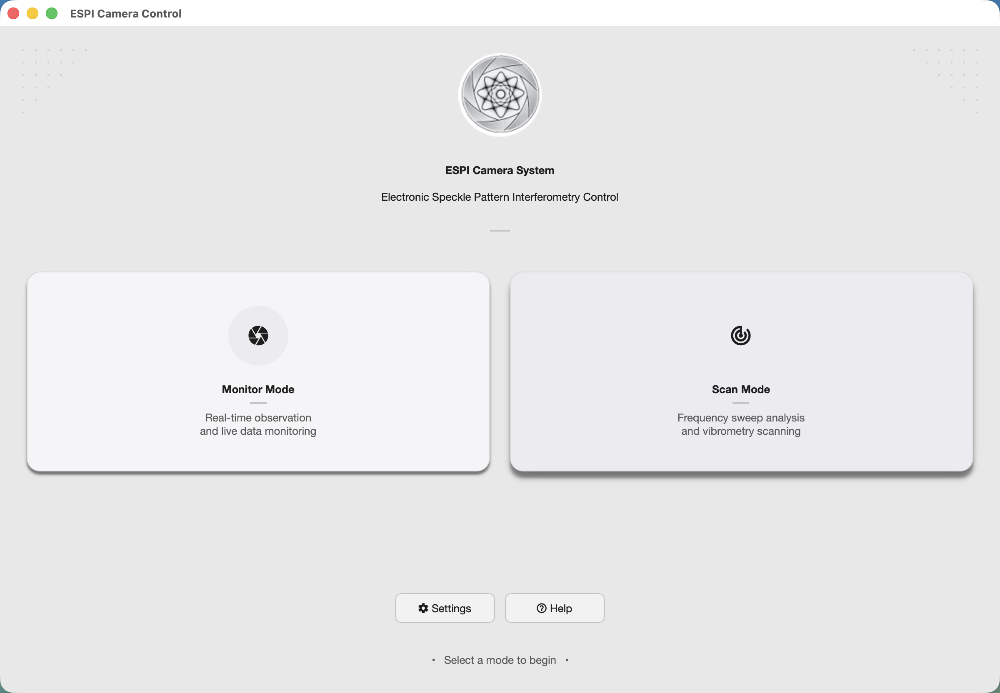
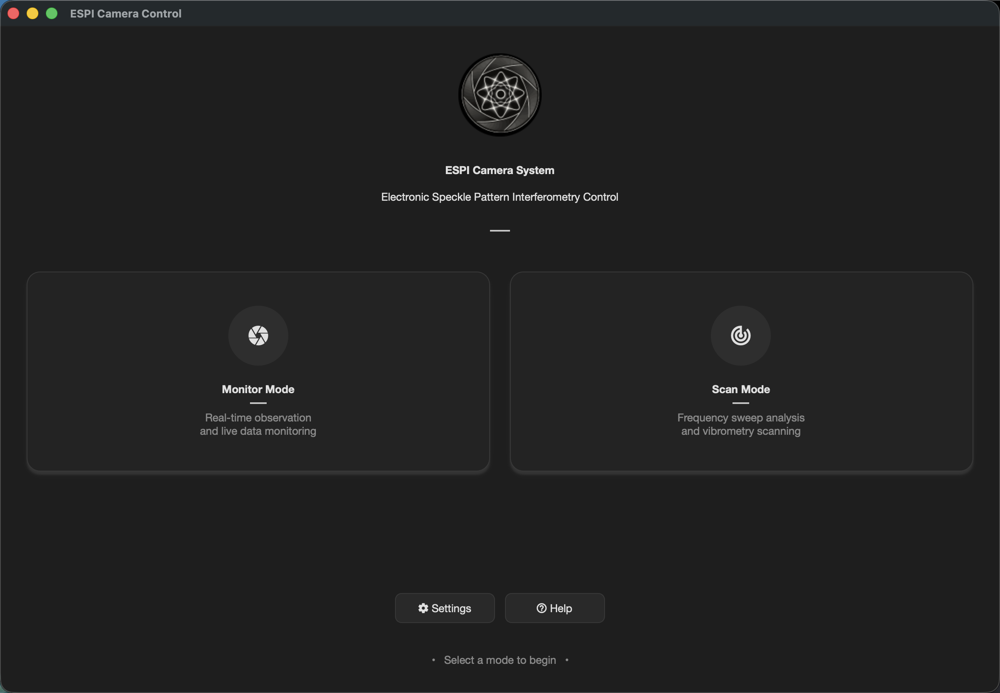
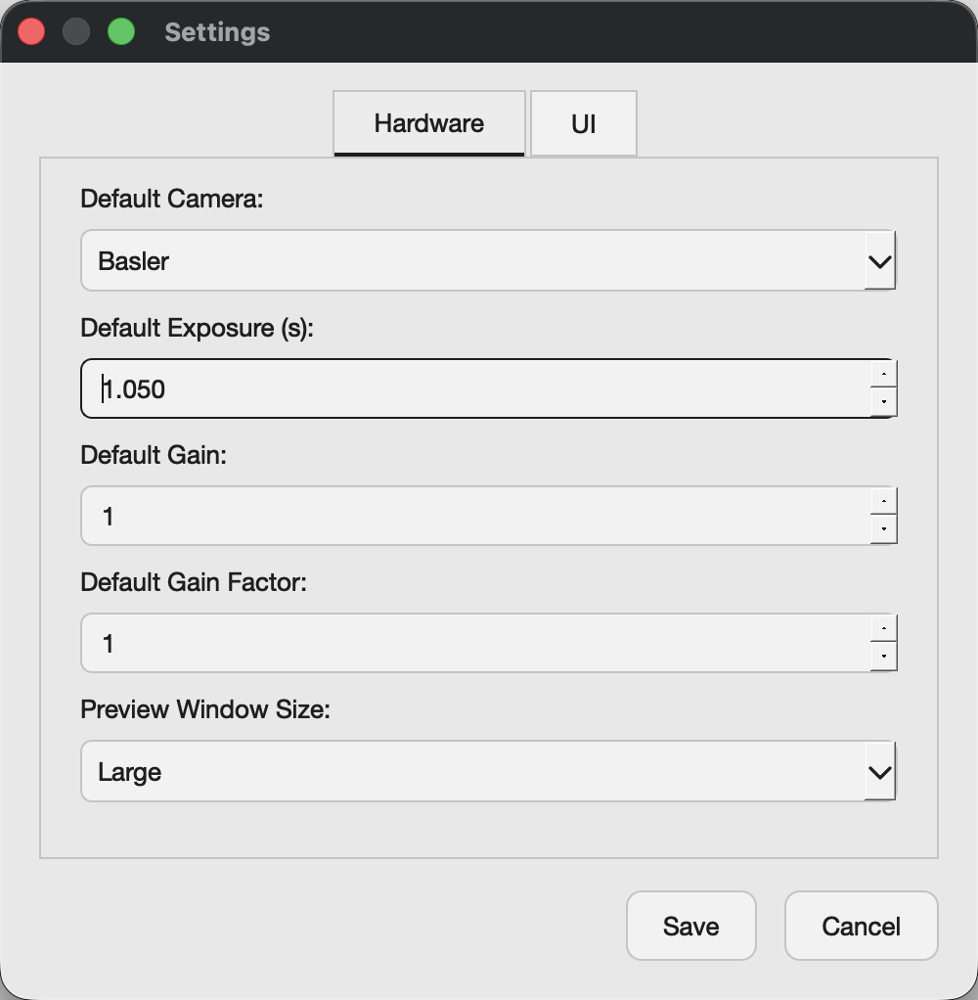
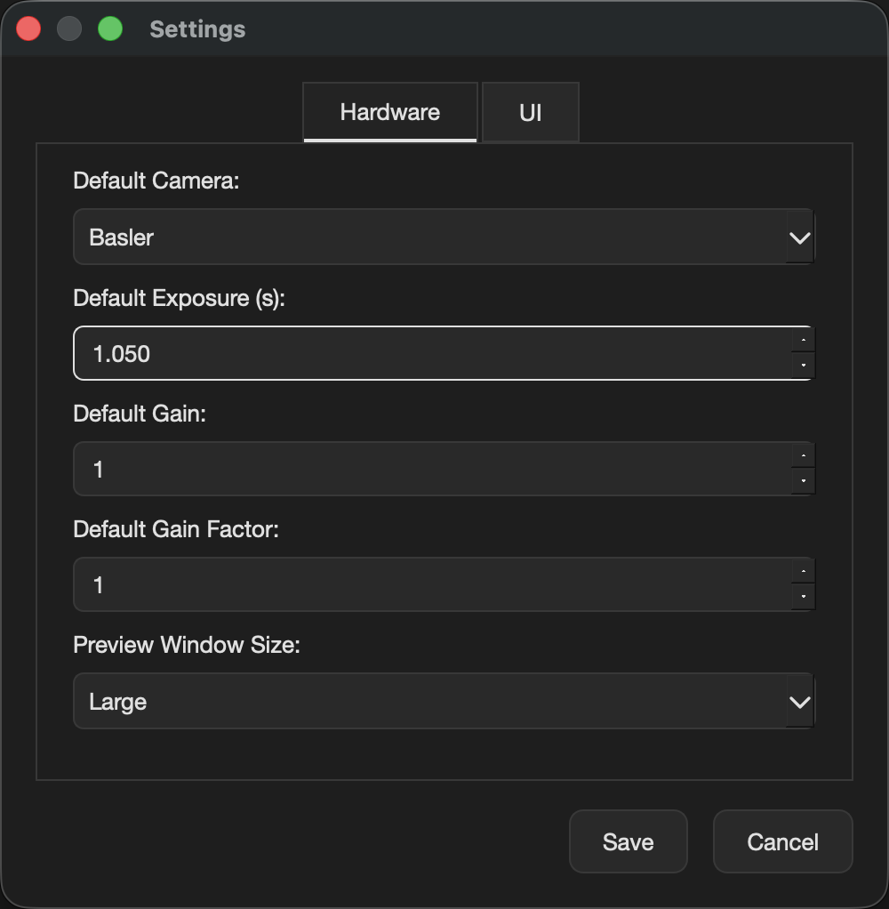
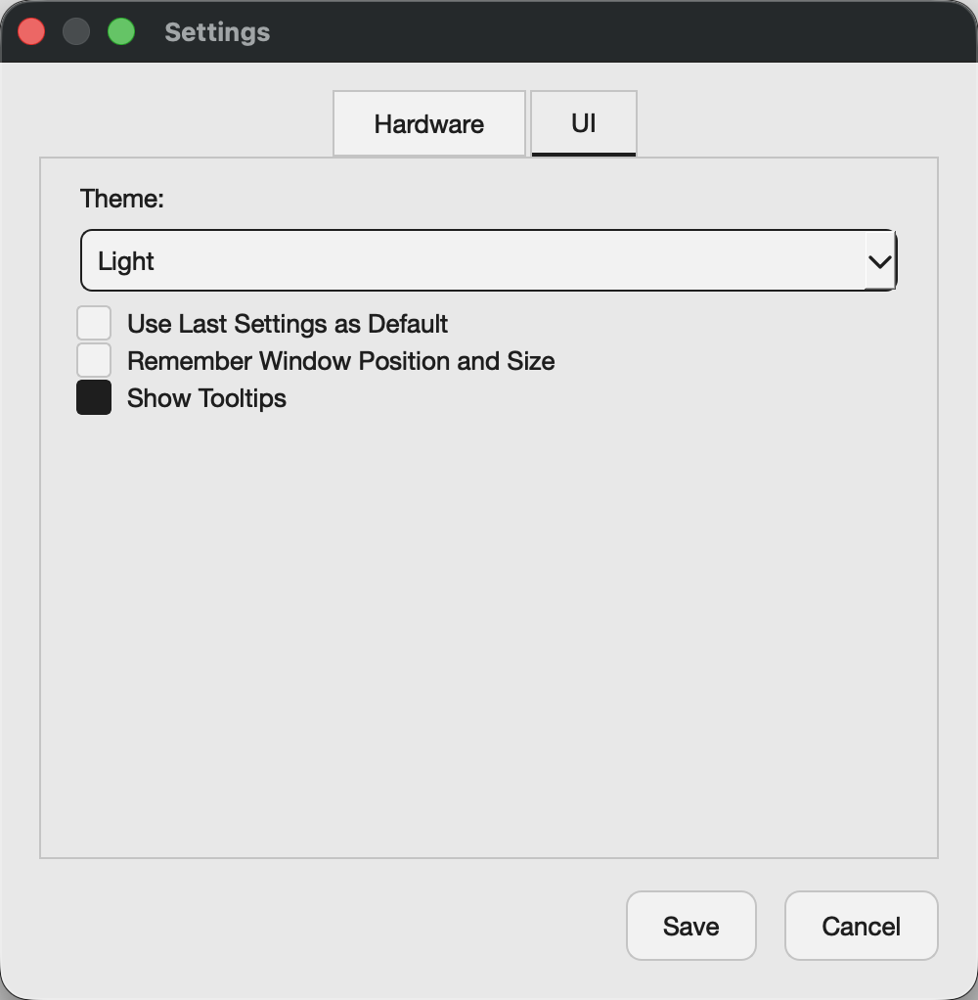
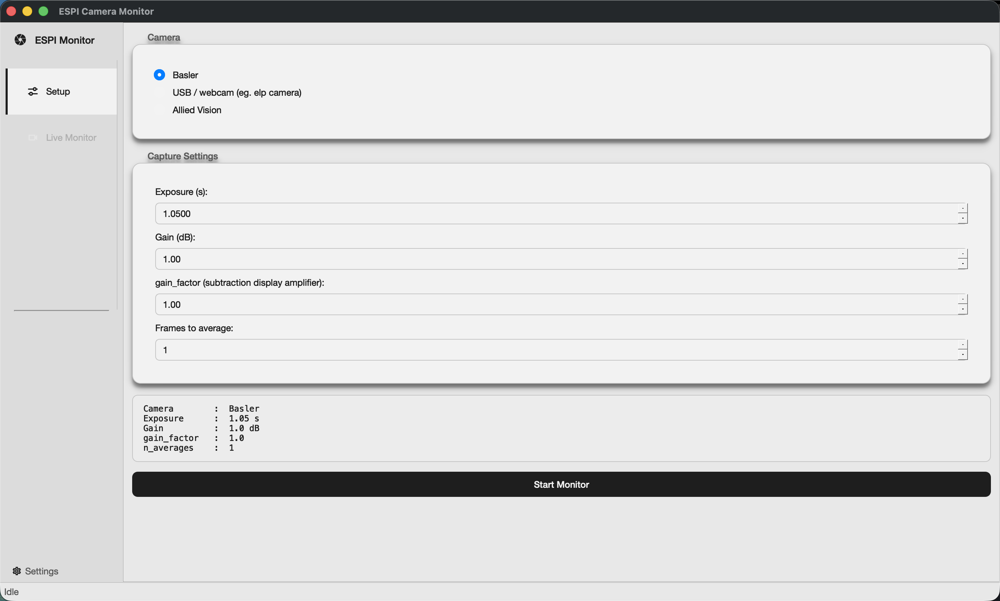
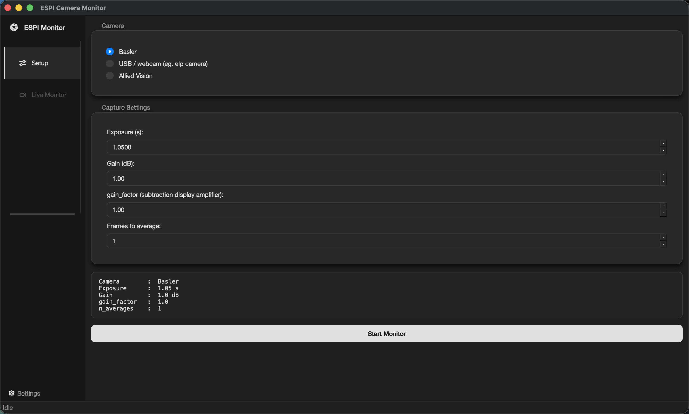
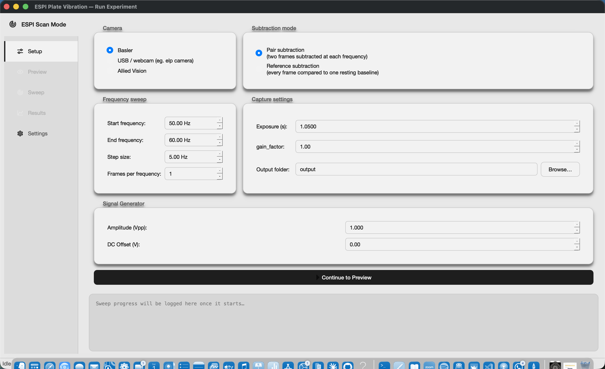
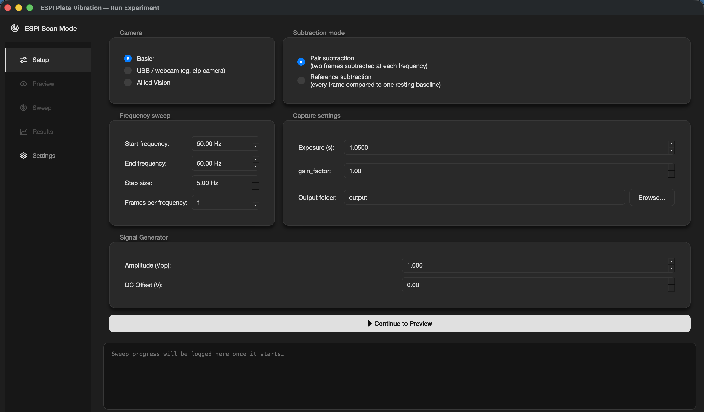

# espi_app: Unified Landing Page GUI

A single PyQt6 window that ties the two existing dashboards together:
Monitor Mode (`monitor_gui.py`) and Scan Mode (`run_experiment_gui.py`),
both of which live in `ESPI Full Algorithm/`. Instead of remembering
which script to run for which task, you run one app and pick a mode from
a landing page.

If you are new to the project, start with the root
[README.md](../README.md) instead of this file: it has the full,
step by step install guide (Python, Git, a virtual environment, and so
on) ending in the exact command that opens this app. This file is a
deeper reference for espi_app specifically, once you already have it
running. Monitor Mode and Scan Mode are documented in detail, with their
own screenshots, in [ESPI Full Algorithm/README.md](../ESPI%20Full%20Algorithm/README.md).


## What It Looks Like

**Light Mode:**


**Dark Mode:**


Every window in the app follows whichever theme you pick in Settings,
not only the landing page. Here is the Settings dialog itself in both
themes:

<p align="center">
  
  
</p>

And the UI tab, where the theme itself lives:



Clicking Monitor Mode or Scan Mode opens that dashboard in its own
window, still matching your chosen theme:

<p align="center">
  
  
</p>
<p align="center">
  
  
</p>


## What It Does

The landing page shows two mode buttons, plus Settings and Help:

* **Monitor Mode**: opens `monitor_gui.py`'s dashboard for watching the
  live camera feed and frame subtraction, without running a full
  frequency sweep.
* **Scan Mode**: opens `run_experiment_gui.py`'s dashboard for running
  a full frequency sweep experiment (Setup, Preview, Sweep, and
  Results, all in one window).
* **Settings**: configure default camera, exposure, gain, and theme.
  Settings persist to `~/.espi_app/settings.json`.
* **Help**: a short summary of what each mode does.

Both dashboards open in their own window, independent of the landing
page. Clicking a mode button again while its window is already open just
brings that window to the front instead of opening a second one. Closing
a dashboard window re-enables its button on the landing page.


## Tech Stack

**Language:** Python 3.10 or newer (this project's own virtual
environment currently runs 3.14).

**GUI Framework:** PyQt6, a cross platform desktop application
framework built on top of the Qt library.

**Supporting libraries:** `qtawesome` for the icon set (the gear icon on
the Settings button, the camera and radar icons on the mode cards, and
so on), plus whatever Monitor Mode and Scan Mode themselves need
(`opencv-python`, `numpy`, `matplotlib`) once you actually open one of
them, since espi_app only imports those two dashboards' code the moment
you click their button.

**Why these matter:** Python is widely used in science and is
approachable for a first CS project, so the whole lab's tooling (camera
control, signal generator control, image processing, and this GUI) stays
in one language. PyQt6 draws windows that look native on Mac, Windows,
and Linux from the same source code, so nobody on the team needs a
different build for their operating system.


## How the Landing Page Works

This section is for anyone who wants to modify the app, not just run it.
For a plain English, file by file walkthrough of the same logic
described below, see the `pseudocode/espi_app/` folder at the project
root (`main.md`, `main_window.md`, `mode_card.md`, `logo.md`,
`background_decoration.md`, `settings.md`, `settings_dialog.md`,
`styles.md`), useful if you would rather read a description of what a
function does before reading the actual Python.

`main.py` is the entry point. It does four things, in order: load
settings from `~/.espi_app/settings.json`, create the PyQt6
`QApplication`, apply the saved theme, and show `LandingPage`.

`main_window.py` defines `LandingPage`, the window in the screenshots
above. The two big buttons are not plain `QPushButton`s: a
`QPushButton` can only show one label, and each card needs an icon, a
title, and a separate description line. `mode_card.py` defines
`ModeCard`, a small custom widget that tracks its own mouse press and
release to behave like a button, and emits a `clicked` signal when you
click it. `LandingPage` listens for that signal and reacts by opening
the matching dashboard.

Opening a dashboard is lazy on purpose. `monitor_gui.py` and
`run_experiment_gui.py` pull in `opencv-python` and `matplotlib`, both
somewhat slow to import. `LandingPage` does not import either module at
startup: it waits until you actually click Monitor Mode or Scan Mode,
then imports and constructs that dashboard's window for the first time.
This is why the landing page itself opens quickly even though the full
app has a lot of dependencies.

Settings live in two separate files that get kept in sync.
`~/.espi_app/settings.json`, managed by `settings.py`'s
`SettingsManager`, is this app's own file: camera and exposure defaults,
window geometry, and the theme. `ESPI Full Algorithm/settings_manager.py`
manages a second file, `~/.espi/settings.json`, that Monitor Mode and
Scan Mode read on their own, even when launched by themselves with
`python3 monitor_gui.py` and no espi_app involved at all. Every time you
open a dashboard or change the theme, `main_window.py`'s
`_sync_settings_to_espi_full_algorithm()` copies the relevant values
into that second file, so both dashboards always open on the theme and
preview size you picked here.


## Where to Make Changes

A quick map for common edits, so you do not have to read every file to
find the right one:

* **Want to change what the landing page says or how it is laid out?**
  Edit `main_window.py`. The title, subtitle, and card text are set near
  the top of `LandingPage.__init__`.
* **Want to change the look of the mode cards** (the two big buttons)?
  Edit `mode_card.py` for their shape and hover behavior, or
  `styles.py`'s `landing_accent_colors()` for their colors.
* **Want to add a new Settings field?** Add the default value in
  `settings.py`'s `_load_settings()`, add the widget in
  `settings_dialog.py`, and read it back wherever it is needed with
  `SettingsManager().get("section.key")`.
* **Want to change the color palette itself** (not just which widget
  uses which color)? Edit `ESPI Full Algorithm/theme.py`. It is shared
  by all three windows (landing page, Monitor Mode, Scan Mode), so a
  change there applies everywhere at once.
* **Want to change the logo?** Replace `logo.svg`, then launch the app
  (`python -m espi_app.main`) to see it rendered on the landing page and
  dashboard title bars by `logo.py`'s `ESPILogo`.


## Setup

The full, step by step setup guide (installing Python, Git, and a code
editor; getting the code; creating and activating a virtual environment;
installing dependencies; running the tests) lives in the project root's
[README.md](../README.md), in its "Getting Started" section. Follow that
guide from the very top if this is your first time setting this project
up; it ends with the exact command below.

Once you already have the virtual environment set up and active, the two
commands you need from inside the project folder are:

```bash
pip install -r requirements.txt
pip install -r "ESPI Full Algorithm/requirements.txt"
```

The second install pulls in what Monitor Mode and Scan Mode need
(camera libraries, `matplotlib`, and so on), since espi_app opens their
code directly.

### Verification

```bash
python -m pytest espi_app/tests/ -v
```

You should see every test pass. If any of them fail, re-check that your
virtual environment is active and that both installs above completed
without errors.


## Running the App

### Command

From the project root, with your virtual environment active:

```bash
python -m espi_app.main
```

### What You Should See

A window titled "ESPI Camera Control" opens: the ESPI logo, a title and
subtitle, two large cards (Monitor Mode and Scan Mode), and Settings and
Help buttons at the bottom, matching the screenshots earlier in this
file. Nothing else needs to be running first; no camera or signal
generator has to be plugged in just to see this window.

### If Nothing Happens

See the Troubleshooting section below.


## Theme

Light and dark theme (and every icon color) is shared across all three
windows: the landing page, Monitor Mode, and Scan Mode, via
`ESPI Full Algorithm/theme.py`. Changing the theme in Settings updates
every currently open window immediately, and is saved so a dashboard
opened later (or run standalone with `python3 monitor_gui.py`, with no
espi_app involved at all) starts on the same theme. Light mode is always
several distinct shades of light gray, never pure white; dark mode is
always several shades of dark gray, never pure black.


## Settings

Configurable from the Settings dialog, organized into two tabs:

**Hardware**: default camera, exposure, gain, gain factor, preview
window size.

**UI**: light/dark theme, "Use Last Settings as Default", whether to
remember window position and size, and whether to show tooltips.

Theme and preview size always bridge into
`ESPI Full Algorithm/settings_manager.py`'s own settings file
(`~/.espi/settings.json`), the same one Monitor Mode and Scan Mode read
their own defaults from. Camera, exposure, gain, and gain factor bridge
too, but how depends on "Use Last Settings as Default":

* **Off (default)**: the Hardware tab's values are the starting
  defaults for both dashboards. Editing them here and saving pushes them
  out immediately. A change made *inside* a dashboard's own Setup page
  or Settings page stays local to that dashboard and is not overwritten
  just by reopening it from espi_app.
* **On**: the Hardware tab (and both dashboards' own Setup/Settings
  fields for camera, exposure, gain, gain factor, and, in Scan Mode,
  frequencies/step/averages) become read only. Whichever dashboard you
  actually run (a Monitor session or a Scan sweep) auto-saves its
  current values as the new shared defaults the moment it starts, and
  the Hardware tab live pulls and displays whichever dashboard ran most
  recently. To edit any of these by hand again, turn the toggle off
  first.


## Tests

```bash
python -m pytest espi_app/tests/ -v
```

Tests run with `QT_QPA_PLATFORM=offscreen` automatically (set in
`espi_app/tests/conftest.py`), so no display is needed. They also
redirect `~/.espi_app/settings.json` to a temporary per-test directory,
so running the suite never touches your real saved settings.


## Troubleshooting

### "ModuleNotFoundError: No module named ..."

A Python package did not install correctly.

1. Make sure your virtual environment is active. You should see
   `(venv_physics)` at the start of your terminal line.
2. Re-run both installs:
   ```bash
   pip install -r requirements.txt
   pip install -r "ESPI Full Algorithm/requirements.txt"
   ```
3. Try running the app again.

### "Command not found" or "'python' is not recognized"

You are either in the wrong folder or Python is not installed.

1. Check where you are: `pwd` on Mac, `cd` (with no arguments) on
   Windows.
2. Verify Python is installed: `python3 --version` on Mac,
   `python --version` on Windows.

### The window opens but Monitor Mode or Scan Mode will not launch

Click the button again. If a dialog titled "Monitor Mode Error" or
"Scan Mode Error" appears, it means `monitor_gui.py` or
`run_experiment_gui.py` raised an exception while starting, usually a
missing dependency from `ESPI Full Algorithm/requirements.txt` rather
than a camera problem (no camera needs to be connected just to reach
the Setup page). Read the error text in the dialog. It is the same
Python exception message you would see in the terminal.

### Settings do not seem to save

Check that `~/.espi_app/settings.json` exists and that your user account
can write to your home folder. Deleting that file resets espi_app to
factory defaults; it will be recreated automatically the next time you
run the app.

### The window looks wrong after switching themes

This should not happen; theme changes are meant to apply instantly to
every open window. If it does, please report it (see Found a Bug?
below) with a screenshot and the theme you switched from and to.

### Found a Bug?

Report it on GitHub:
1. Go to the project's GitHub repository.
2. Click "Issues" at the top.
3. Click "New Issue".
4. Describe what happened and include the error message, if any.

Do not include personal email addresses in issues; use GitHub Issues
only.


## Files

* `main.py`: application entry point
* `main_window.py`: `LandingPage`, including the Monitor/Scan launch
  logic and the settings bridge into `ESPI Full Algorithm/`
* `mode_card.py`: `ModeCard`, the custom clickable widget behind the two
  big buttons on the landing page
* `logo.py`: `ESPILogo`, renders `logo.svg` for the landing page and
  Monitor/Scan title bars
* `background_decoration.py`: `LandingBackground`, the landing page's
  central widget, paints a subtle corner dot decoration behind the logo
  and mode cards
* `settings.py`: `SettingsManager`, reads and writes
  `~/.espi_app/settings.json`
* `settings_dialog.py`: the Settings window
* `styles.py`: applies the shared theme (`ESPI Full Algorithm/theme.py`)
  app wide, and defines the landing page's own accent colors
* `tests/`: pytest-qt regression tests
